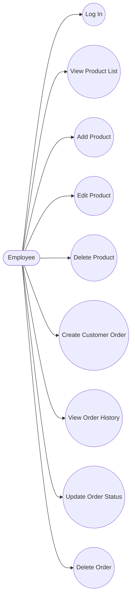
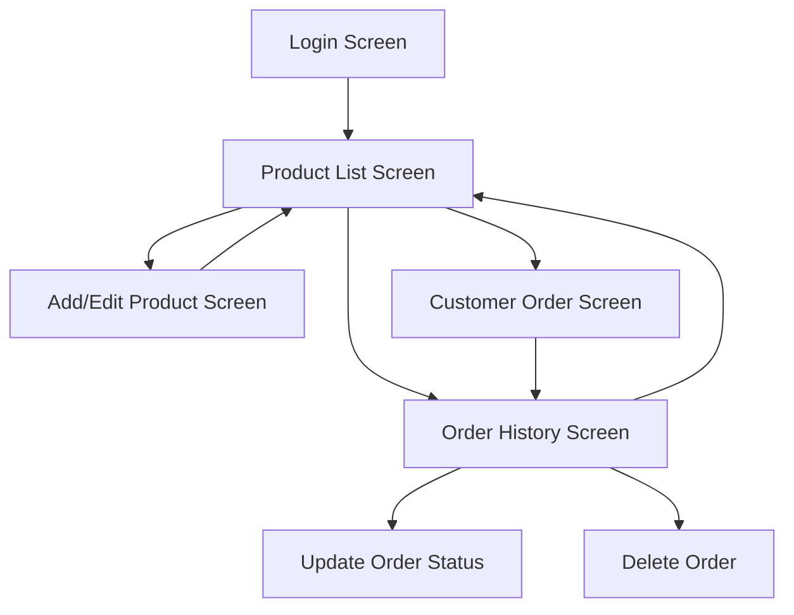

# Mobile Application Development Coursework Report

## Project Title
**BrewLog: Coffee Order and Product Management Mobile Application**

## 1. Introduction
BrewLog is a mobile application designed for a small retail business that manages wholesale coffee products and customer orders. The original manual notebook process creates problems such as lost records, duplicated entries, inaccurate stock tracking, and slow order processing. BrewLog replaces that manual workflow with a digital Android application so employees can log in, manage products, create customer orders, and review order history from a smartphone.

The app was developed in **Android Studio** using **Kotlin** and stores data locally in an **SQLite** database. Although the coursework brief mentions Java, the delivered implementation uses Kotlin while still meeting the same Android development objectives, including activity-based navigation, database operations, and form-driven user interaction.

## 2. Problem Statement
The business currently records product and customer order information manually in notebooks. This causes several operational issues:
- Orders can be misplaced or written incorrectly.
- Product stock is difficult to track accurately.
- It is hard to review previous sales quickly.
- Manual calculations increase the risk of pricing and quantity errors.
- Employees cannot easily update product details or order status in real time.

The goal of the application is to centralize product and order management in one secure mobile system that is fast, accurate, and easy to use.

## 3. Task 1: Requirements Analysis

### 3.1 Purpose of the Application
The purpose of BrewLog is to help employees manage coffee product information and customer orders digitally. It supports login, product maintenance, order creation, and order history tracking while automatically updating stock levels in the database.

### 3.2 Functional Requirements
The application provides the following functional requirements:

1. **User authentication**
   - Employees must log in using a valid username and password before accessing the system.

2. **Product management**
   - Employees can add, edit, and delete coffee products or batches.

3. **Product listing**
   - The system must display all products in a scrollable list with freshness information and stock details.

4. **Customer order creation**
   - Employees can create an order by selecting a customer, a product, and a quantity.

5. **Order history management**
   - The system must display past orders and allow status updates and deletion.

### 3.3 Non-Functional Requirements
The application also includes these non-functional requirements:

1. **Usability**
   - The interface should be simple, readable, and optimized for mobile use.

2. **Reliability**
   - Database operations should complete safely and maintain consistent stock and order records.

3. **Performance**
   - Screens should load quickly and database queries should return results efficiently for small business use.

### 3.4 Use Case Diagram
The following diagram shows how employees interact with the system.



## 4. Task 2: System Design

### 4.1 User Interface Design
The application uses a clean Material-style interface with cards, buttons, text fields, dropdowns, and recycler lists. The color palette is based on coffee-themed brown and cream tones to match the business domain.

### 4.2 Screen Designs
The application includes the following key screens:

#### 1. Login Screen
- Accepts username and password.
- Shows validation errors for empty or invalid credentials.
- Uses a demo credential hint for coursework testing.

#### 2. Product List Screen
- Displays all coffee products.
- Shows product freshness badges, price, origin, and stock.
- Includes direct edit and delete actions.
- Provides quick navigation to add products and orders.

#### 3. Add/Edit Product Screen
- Allows employees to enter product name, origin, roast level, roast date, price, and stock.
- Uses input filters and form validation.
- Supports both create and update operations.

#### 4. Customer Order Screen
- Lets employees select a customer and a product.
- Calculates the total price live as quantity changes.
- Prevents ordering more than available stock.
- Automatically deducts stock when an order is placed.

#### 5. Order History Screen
- Displays previous orders.
- Shows colored status badges.
- Allows direct update and delete actions from the list.

### 4.3 Navigation Flow Diagram
The navigation flow between screens is shown below.



### 4.4 Database Schema
The application uses SQLite and includes the following tables:

#### Product Table
| Field | Type | Description |
|---|---|---|
| id | Integer | Primary key |
| name | Text | Product or batch name |
| origin | Text | Coffee origin |
| roast_level | Text | Light, Medium, or Dark |
| roast_date | Text | Date roasted in YYYY-MM-DD format |
| price_per_kg | Real | Product price per kilogram |
| stock_kg | Real | Current stock quantity |

#### Customer Table
| Field | Type | Description |
|---|---|---|
| id | Integer | Primary key |
| cafe_name | Text | Customer cafe or business name |
| contact_name | Text | Main contact person |
| email | Text | Contact email |

#### Orders Table
| Field | Type | Description |
|---|---|---|
| id | Integer | Primary key |
| customer_id | Integer | Foreign key to customer |
| product_id | Integer | Foreign key to product |
| quantity_kg | Real | Quantity ordered |
| total_price | Real | Order total |
| order_date | Text | Timestamp of order |
| order_status | Integer | Pending, shipped, or cancelled |

#### Employee Table
| Field | Type | Description |
|---|---|---|
| id | Integer | Primary key |
| username | Text | Login username |
| password | Text | Login password |
| full_name | Text | Employee display name |

### 4.5 Entity Relationship Overview
- One customer can place many orders.
- One product can be referenced by many orders.
- One employee account is used for login and access control.
- Orders reference both customer and product records using foreign keys.

## 5. Task 3: Mobile Application Development

### 5.1 Development Environment
- **IDE:** Android Studio
- **Language:** Kotlin
- **Database:** SQLite
- **UI:** XML layouts with ViewBinding and Material components
- **Navigation:** Android Intents between activities

### 5.2 Core Features Implemented
The application includes the required core functions:
- User login screen
- Add, edit, and delete products
- View product list
- Create customer orders
- View order history

### 5.3 Technical Implementation Summary
The app follows a layered structure:
- **Database layer:** SQLiteOpenHelper and DAO classes manage data access.
- **UI layer:** Activities and adapters render screens and lists.
- **Utility layer:** Formatting, validation, badge logic, and seed data.

### 5.4 Sample Code

#### Activity Creation
```kotlin
class LoginActivity : AppCompatActivity() {

    private lateinit var binding: ActivityLoginBinding
    private lateinit var dao: BrewLogDao

    override fun onCreate(savedInstanceState: Bundle?) {
        super.onCreate(savedInstanceState)
        binding = ActivityLoginBinding.inflate(layoutInflater)
        setContentView(binding.root)

        dao = BrewLogDao(this)
        BrewLogSeedData.seedIfNeeded(dao)
    }
}
```

#### Database Operation: Insert
```kotlin
fun insertEmployee(employee: Employee): Long = databaseHelper.writableDatabase.use { db ->
    db.insert(BrewLogContract.Employees.TABLE_NAME, null, employee.toContentValues())
}
```

#### Database Operation: Update
```kotlin
fun updateProduct(product: Product): Int = databaseHelper.writableDatabase.use { db ->
    db.update(
        BrewLogContract.Products.TABLE_NAME,
        product.toContentValues(),
        "${BaseColumns._ID} = ?",
        arrayOf(product.id.toString()),
    )
}
```

#### Database Operation: Delete
```kotlin
fun deleteProduct(productId: Long): Int = databaseHelper.writableDatabase.use { db ->
    db.delete(
        BrewLogContract.Products.TABLE_NAME,
        "${BaseColumns._ID} = ?",
        arrayOf(productId.toString()),
    )
}
```

#### Event Handling: Button Click
```kotlin
binding.buttonLogin.setOnClickListener {
    val username = binding.editTextUsername.text?.toString().orEmpty().trim()
    val password = binding.editTextPassword.text?.toString().orEmpty()

    val employee = dao.authenticateEmployee(username, password)
    if (employee != null) {
        startActivity(Intent(this, ProductListActivity::class.java))
    }
}
```

### 5.5 Login Credentials
For demonstration and testing, the seeded employee account is:
- **Username:** `admin`
- **Password:** `brewlog`

## 6. Task 4: Testing and Evaluation
Functional testing was carried out to confirm that the application behaves correctly. The following test cases were used.

| Test Case | Input | Expected Output | Actual Output |
|---|---|---|---|
| 1. Valid login | Username: admin, Password: brewlog | User is taken to the product list screen | Passed: User enters product list screen |
| 2. Invalid login | Username: wrong, Password: wrong | Error message shown and login rejected | Passed: Invalid credentials message shown |
| 3. Add product | Enter valid product data and save | Product is stored and shown in the product list | Passed: Product saved and displayed |
| 4. Create order | Select valid customer, product, and quantity within stock | Order saved and stock reduced | Passed: Order saved and stock updated |
| 5. Delete order | Select delete on an existing order | Order removed and stock restored | Passed: Order deleted and stock restored |

### Evaluation Summary
The application successfully meets the functional goals of the scenario. Data is stored locally in SQLite, the UI is mobile-friendly, and the flow between screens supports everyday business operations. The main improvement area for future development is stronger authentication security and richer analytics.

## 7. Task 5: Documentation and Presentation
The project documentation should include the following items:
- Introduction
- Problem Statement
- System Design
- Implementation
- Screenshots of the Application
- Conclusion and Future Improvements

### Screenshot Placeholders
The following screenshots should be inserted into the final submitted report:
- Login screen
- Product list screen
- Add/Edit product screen
- Customer order screen
- Order history screen

## 8. Conclusion
BrewLog replaces the manual notebook-based workflow with a practical Android inventory and order management solution. The app improves accuracy, reduces record loss, and makes it easier for employees to manage wholesale products and customer orders on a smartphone.

The project demonstrates the use of Android Studio, activity-based navigation, SQLite database operations, input validation, and list-based user interfaces. It also provides a solid base for additional features such as reporting, cloud backup, barcode scanning, and secure password hashing.

## 9. Future Improvements
Possible enhancements for the next version include:
- Password hashing and more secure authentication.
- Search and filtering for products and orders.
- Sales dashboard with charts and low-stock alerts.
- Export to PDF or CSV.
- Multi-user role management for admins and staff.
- Cloud synchronization using Firebase.

## 10. Deliverables
The project deliverables are:
- Mobile application source code
- APK file
- Project report
- Screenshots of the application
- Presentation demonstration

## Appendix A: Project Notes
- The current implementation uses **Kotlin** rather than Java, while still using Android Studio and SQLite as required by the coursework scenario.
- Default seeded data is included for testing and demo purposes.
- The report can be exported to Word or PDF after screenshots are added.
